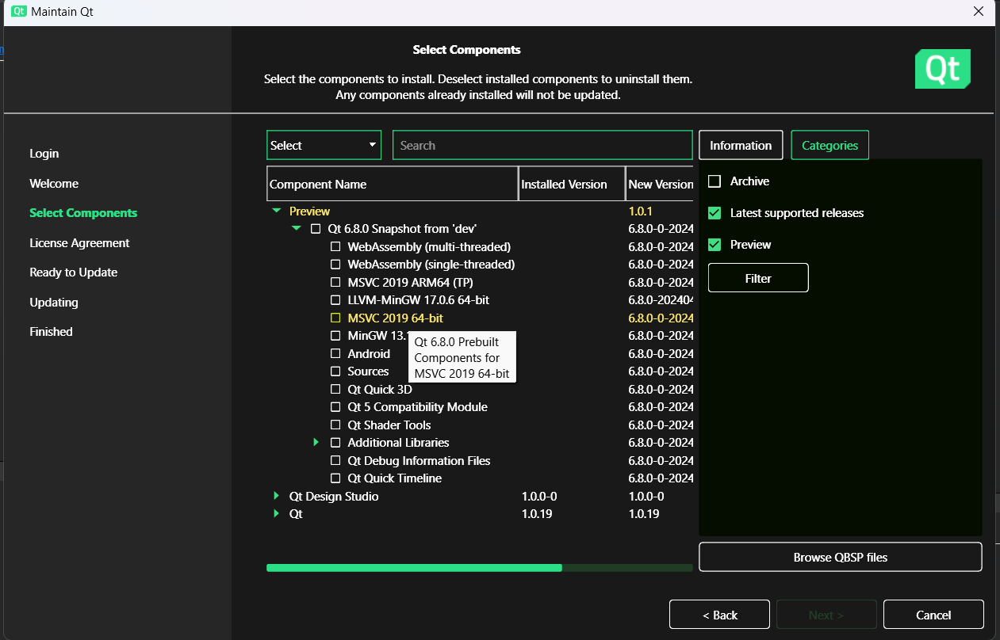

# hex-viewer-SUMURI
A tool used to help teach students about hexadecimal data

# Project Setup Guide for Windows

## Prerequisites

1. **Qt Framework**
2. **MSVC 2019 64-bit compiler**
3. **Qt Creator**

## Step-by-Step Installation Guide

### 1. Install Qt Framework

1. **Download and Install Qt Online Installer:**
   - Go to the [Qt Downloads](https://www.qt.io/download) page.
   - Download the Qt Online Installer for Windows.

2. **Run the Installer:**
   - Open the downloaded installer.
   - Follow the prompts to log in with your Qt account. If you do not have an account, create one.

3. **Select Components:**
   - In the **Select Components** window, select the following:
     - Under `Qt 6.8.0 Snapshot from 'dev'`:
       - Check `MSVC 2019 64-bit`.
       - (Optionally) Check any other components you might need (e.g., `Qt Quick`, `Qt Charts`).
   - **Important:** Ensure `Preview` is checked under `Categories` to see the `Qt 6.8.0 Snapshot from 'dev'`.

4. **Finish the Installation:**
   - Continue with the installation and let the installer download and set up the components.

### 2. Install MSVC 2019 64-bit Compiler

1. **Download and Install Visual Studio 2019:**
   - Go to the [Visual Studio Downloads](https://visualstudio.microsoft.com/downloads/) page.
   - Download and install the Visual Studio 2019 Community Edition (or any other edition you prefer).

2. **Install Required Components:**
   - During installation, ensure you select the following workloads:
     - `Desktop development with C++`
   - Ensure the MSVC 2019 64-bit compiler is installed.

### 3. Configure Qt Creator

1. **Open Qt Creator:**
   - Launch Qt Creator from the start menu or desktop shortcut.

2. **Add Qt Version:**
   - Go to `Tools` > `Options` > `Kits` > `Qt Versions`.
   - Click `Add` and navigate to the Qt installation directory (e.g., `C:\Qt\6.8.0\msvc2019_64`).
   - Select the `qmake.exe` file in the `bin` directory.

3. **Configure Kits:**
   - Go to the `Kits` tab.
   - Ensure a kit is available that uses the MSVC 2019 64-bit compiler and the newly added Qt version.
   - Set this kit as the default.

## Building and Running the Project

1. **Open the Project:**
   - Open Qt Creator.
   - Open your project file `CMakeLists.txt`.

2. **Build the Project:**
   - Select the appropriate kit configured with `MSVC 2019 64-bit` and `Qt 6.8.0`.
   - Build the project by clicking on the build button or pressing `Ctrl+B`.

3. **Run the Project:**
   - Run the project by clicking on the run button or pressing `Ctrl+R`.

4. **Creating the windows installer**
    - Download Inno Setup from https://jrsoftware.org/isdl.php
    - Build the project
    - Run `windows_install_creator.iss`

## Additional Information

- **Documentation:** Refer to the [Qt Documentation](https://doc.qt.io/) for more information on using Qt.
- **Community Support:** Join the [Qt Forum](https://forum.qt.io/) for community support and discussions.

